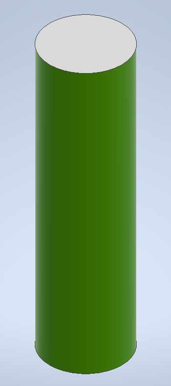
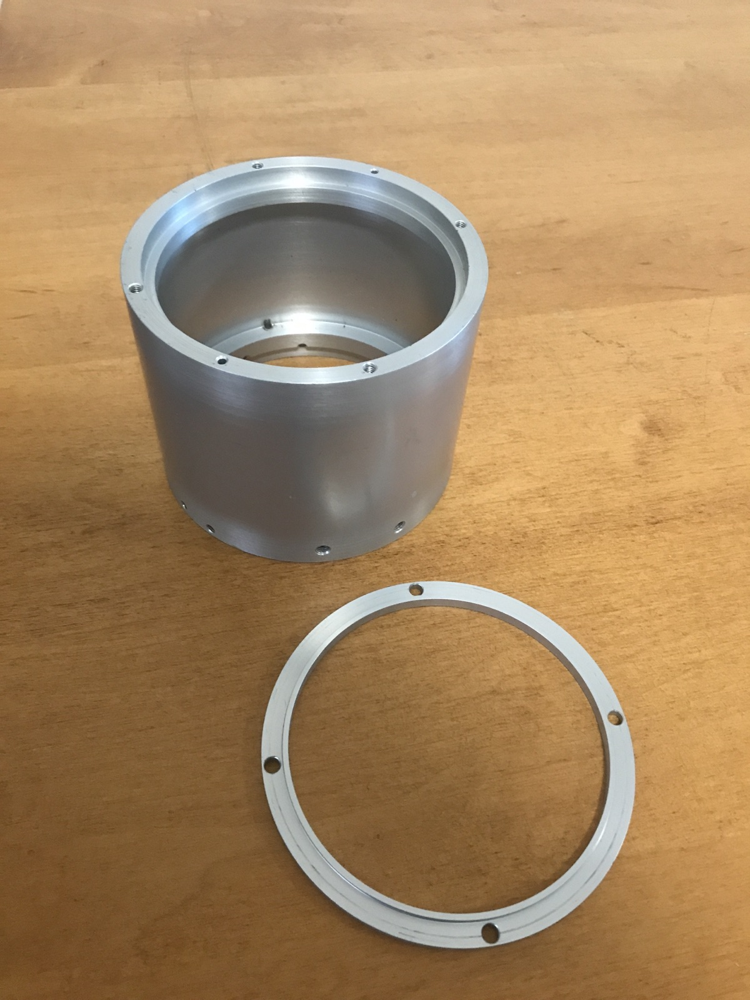
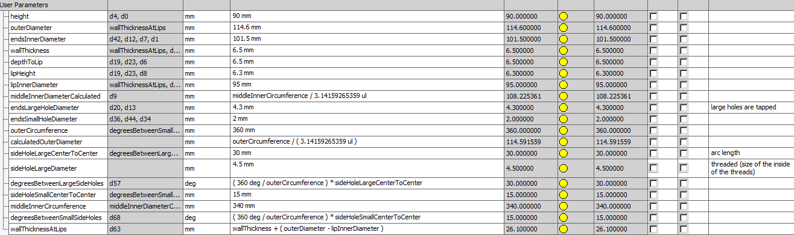
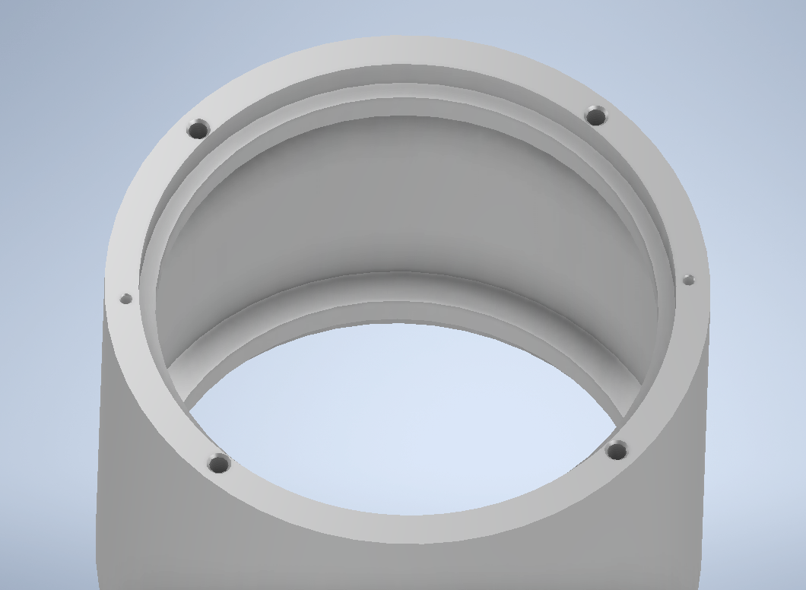
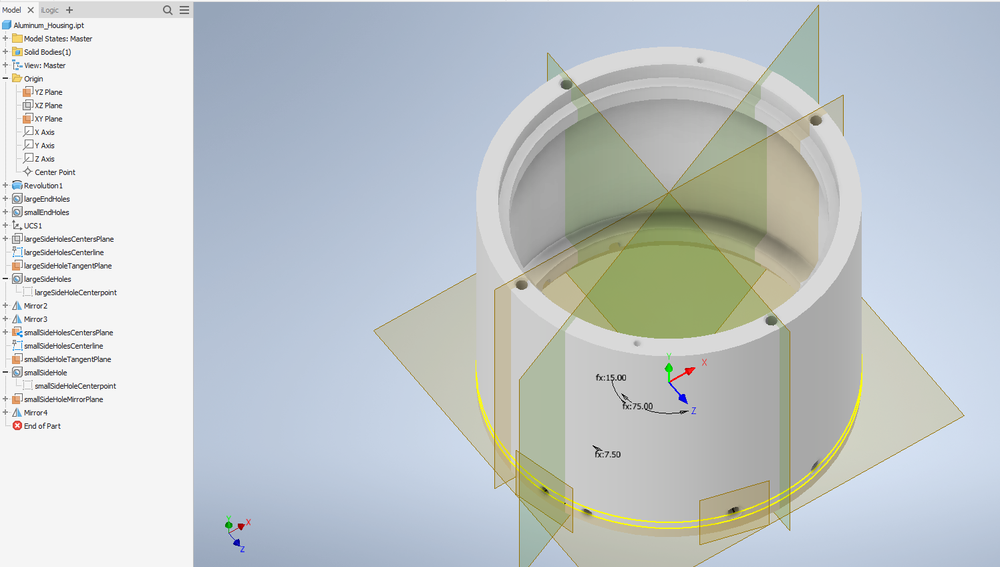
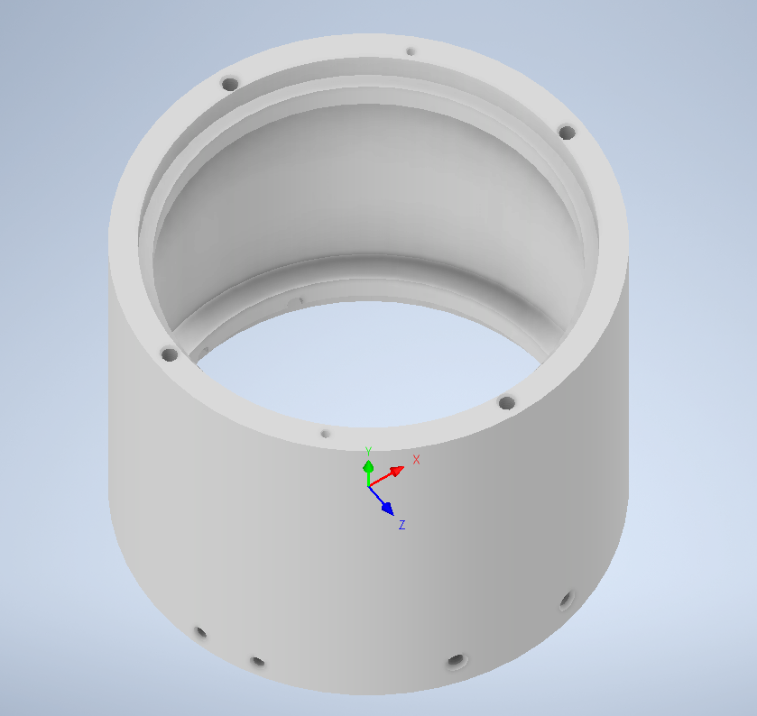
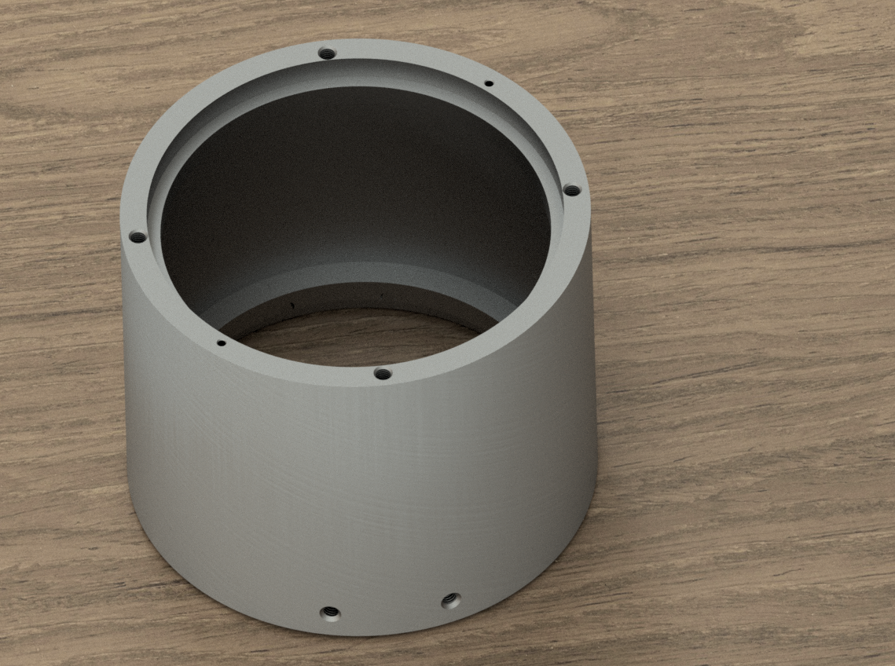

+++
fragment = "content"
weight = 100
+++

# Final Project Proposal
## Electric Scooter
In January-March of 2020, I built an electric scooter (like those Bird ones you see out and about) from scratch. I chose this project primarily for two reasons:
1. I had no idea how to do it, therefore I would learn a lot from it
2. An electric scooter would be handy as I don't always feel like biking and I have to commute a lot

I would say that I accomplished both of these—I learned a lot from CAD to material selection to welding to documentation and everything in between, and it works as a mode of transportation—but I also felt like it was significantly lacking in many aspects. Namely, its security, portability, durability, consistency, and appearance. These have left me to only use it for short trips where I know the battery will last and where I can keep it close to me once I arrive. In other words, just  traveling to my makerspace.

In the time since I initially completed this project, I have thought a lot about how I would improve it in a second iteration. So... I would like to do that (now that I am armed with resources, guidance, and (more) experience).

### Details
I believe that, even if I am unable to fully make an electric scooter in these 7 weeks that I would be able to make good progress as many of the main systems could be an individual week's project. These main, very broad systems could be broken down as follows:
#### The frame
*Good for: Week 8 - CNC Milling, Molding & Casting*

In the V1, the frame is mostly waterjet, folded, and welded 1/16" steel. I would have liked to use alumunium, but it was too expensive to realistically use (and painful to weld, but that was secondary). Additionally, I didn't have enough time to finish the scooter completely, so the handlebar stem is from a cannibalized Razor scooter I got off Craigslist. With that said, folded waterjet steel is kind of a pain to work with, iterate upon, and design for if even somewhat complex geometry is desired.

Because of this, I was left with two main options:
Carbon fiber/fiberglass or machined metal (probably magnesium or alumunium). The former is light, strong, rigid, and is easily iterable with the ability of accomodating complex geometry with the amazing combo of CNC routing + vacuum bagging, but this comes at a great cost (literally). The latter, on the other hand, is also light and strong and can accomodate even more complex geometry, but is also pretty expensive, less easy to iterate upon (though the geometry can be tested accurately with 3D printing), and struggles with large pieces.

That said, there is the rather enticing option of a combination of the two, with the composite materials being used for big bits and machined metal for small, intricate assemblies. Either way, my wallet is going to cry.
#### The powertrain
*Good for: Week 7 - Electronic Output Devices*

The powertrain is the motors (yes; that is motor*S*, plural). These will be electric motors. One will be made from scratch and the other (350 W; brushless DC) I took from the V1 and brought in case it would be useful.

###### Regenerative breaking
I built a motor from scratch earlier this year and I want to improve it. Regenerative braking seems like a nice feature.
While the motor itself is great, redesigning it would probably be best. I would need to build a new one anyway for a proper axel assembly, and a [lynch style motor](https://en.wikipedia.org/wiki/Lynch_motor) would be nicer for a scooter (namely, a slimmer form factor).

###### Two-wheel drive
One intimidating feature I would like to add is two-wheel drive. All the rentable electric scooters I have seen have (Bird, Lyft, Lime, Uber, etc.) don't have this feature; although, admittedly, I haven't done anywhere near as much research as I should, but I do want it. With a custom motor, I think I could even turn the rotor housing into a sun gear and fit planetary gears between the tire and the rotor to gain impressive torque. A gear shift would be amazing, but I don't know of any "radial" gear shifts.
#### The batteries
*Good for: Week 5 - 3D Design & Printing*

Currently, the scooter uses a battery pack I made. It has 26 18650 Li-ion batteries arranged 13 in series with 2 in parallel, for a total voltage of around 48V. These are stacked vertically in a grid, resulting in a rather inconveniently sized/awkwardly shaped battery pack.

I would like to make a second battery pack with the same specifications (18650 Li-ion; 13 in series; 2 in parallel), only this time, I want to avoid spot welding if I can and make it flat. So, instead of connecting the tops and bottoms accross with nickel strips, the pairs of batteries in parallel with each other would be pointing each other, positive end to negative end, and the nickel would be replaced with copper and would run alongside them.

The thin-ness of this pack would make it ideal for fitting in the footboard of the frame, though the frame would need to have added rigidity to avoid bending pack.

This additional battery pack would be used for the second motor in a two-wheel drive setup, and would ideally be easily replaceable—fitting in without needing to fenangle XT60's is a must in this regard (admittedly, this adds something of a design challenge as far as repeatability or safety are concerned, as exposed metal contacts would need to line up and touch repeatedly). A [cardioid track latch (a.k.a. a "push-click" mechanism)](https://www.reddit.com/r/3Dprinting/comments/v9izib/i_had_fun_designing_and_printing_a_mechanical/) with a spring would be great, but it may be a challenge to maintain a slim form factor.

Going a step further with modularity, if spot welding is going to be avoided, then making the individual 18650's easily replaceable in the case of individual failure would be a great advantage for both safety and convenience. Therefore, modularity wouldn't need to be all that important in actuality; instead, repairability should be the goal. For this goal, spot welding should be avoided at all costs.

The reason I believe this would be a good project for *Week 5 - 3D Design & Printing* is because I think the battery pack modules be a great fit for 3D printing. Adding a snapping mechanism is pretty easy when modeling for 3D printing, especially if it's made to be semi-permanent without destruction, and the battery pack would not need to be particuarly strong because it is the frame's job to protect it. Also, in the unlikely event that a Li-ion fire is started, it wouldn't really matter what material the battery pack frame is made out of.

#### The control system
*Good for: Week 4 - Microcontroller Programming*

This would encompass:
* The **E**lectronic **S**peed **C**ontrollers/motor controllers (the **P**ulse **W**ith **M**odulation magic makers)
* Microcontroller (for systems like LED's, headlights, HUD, etc.)

Software features that would be nice:
* Informational display content:
	* battery health, RPM/speed, distance covered on current charge ("mileage"), total distance covered
* Regenerative braking
* Halting power to motors upon braking
* Putting motors in neutral
* PID
#### The inputs
*Good for: Week 6 - Electronic Input Devices*

The main input would be from the throttle, but there's also charging ports to think about, as well as an IMU, tachometer, **B**attery **M**anagement **S**ystem(s), "school zone" button (that would cap top speed), and more.
#### Security & Safety
*Good for: Week 9 - Radio, WiFi, Bluetooth (IoT)*

There  are a lot of various features I want for security, as many parts (namely, the batteries) are rather expensive and very easy to steal in the V1. There are also various safety features that would be good to have. To list a few of both of these:
* LED strips
* Bright LED headlight
* Key to start
* Holes in frame for a bikelock lock
* Battery lock
* RFID
* Thumbprint to start?
* Braking (friction brake could have a limit switch (or software looks for a current spike) to know when to put motor in nuetral/engage regenerative braking)

I say that this would be good for *Week 9 - Radio, WiFi, Bluetooth (IoT)* because I think requiring RFID to start would be a nice added layer of security.
#### Wildcards

Fun or convenient features that will probably be relegated almost exclusively to future addons, though they could be considered when designing. Including but not limited to:
* Griptape pattern (the name of the scooter should be a bright, contrasting color in the griptape)
* Suspension and/or shock absorbtion
* Folding (a folding system could be included in the frame)
* Kickstand (could be 3D printed out of something like ASA or lost-PLA cast into alumunium to avoid machining)
* Waterproofing (a major flaw with the current scooter is that it is not waterproof; total waterproofing would be extremely difficult, but it may be possible to waterproof only certain systems)
* "dashcam" (little arduino camera below the headlight)

- - -

# "Household" Object CAD
My household is perhaps somewhat odd in its objects, and, because they would both be models I need later on, I chose to CAD the piece of aluminum stock I have and an 18650 Li-ion battery.

Because I am better acquainted with it, I used Autodesk Inventor to design my parts instead of Fusion360.

#### 18650 Li-Ion Battery

This one can be made with just two parameters: `diameter` and `height`. We could use a revolve, extrude, or even sweep to make it. We'll go with extrude because it is the one everyone's familiar with. My 18650's measure, shockingly enough, 18.0 mm in diameter by 65.0 mm tall.

We'll go ahead and set the outside to a nice chartreuse with an eggshell finish so we can clearly recognize it as a battery in later designs.

#### Aluminum Stock/Future Motor Housing

This one is quite a bit more complicated than the cylindrical battery. Right now, we'll just model the large stock and not the ring.

We'll go ahead and take a bunch of measurements of all we can see, and then work them into parameters later once we start designing. Doing this, we end up with the following:

This looks pretty good and, if we find out that we're missing something later on, we can just add it in. After doing just that a couple times, this is what our parameters look like:

The main feature will be made with a revolve about the Y-axis and the holes–both threaded and not–will be made with the hole tool being repeated in a circular pattern.

Now we have this:

To make the side holes, we make a whole mess of planes. To put these planes in the right place, we will use the `Normal to Axis Through Point` with the edge and point being a line we will make. To orient this line correctly, we will make a plane offset from the bottom of the housing that will go through the center of the holes. We start our sketch there and then measure the center-to-center distance with a flexible tape measure. By dividing 360 degrees by the circumference and multiplying by the center-to-center distance, we end up with the degrees between the two holes. We angle our line with this measurement and make our `Normal to Axis Through Point`. On this plane, we start a new sketch, put two points coincident to each other. We make a hole centered on that point, pattern it, and repeat for the smaller holes.

After all that, we have this mess of planes:

Aluminum_Housing_Finished-No_Planes

Finally, we can set the material to be a brushed aluminum and we're finished.

Just for fun, we can render it out on a "table" (a rectangle with a wooden texture):

