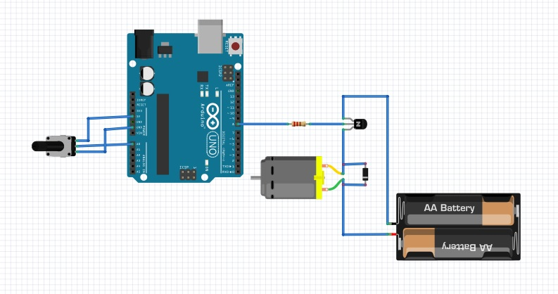
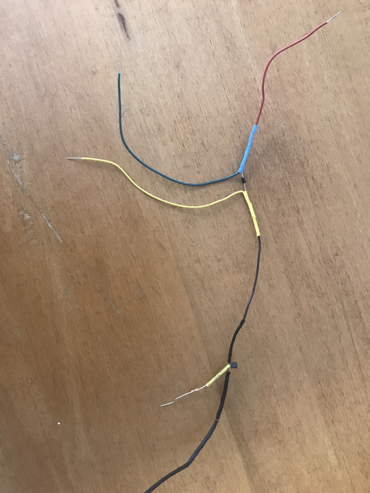
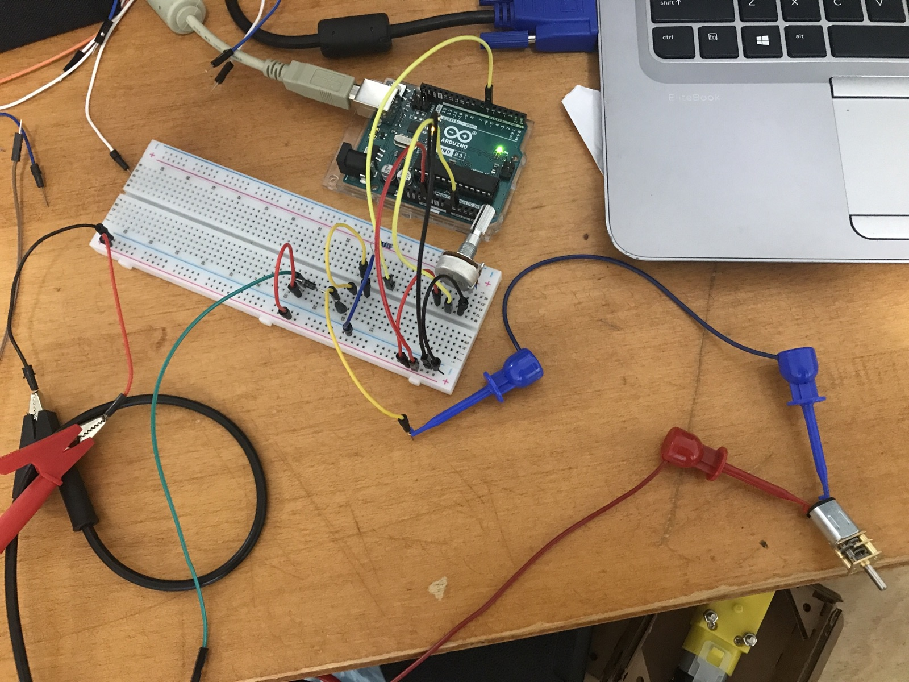
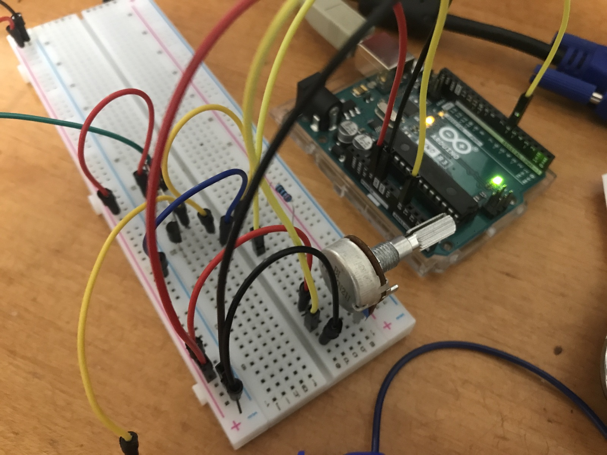
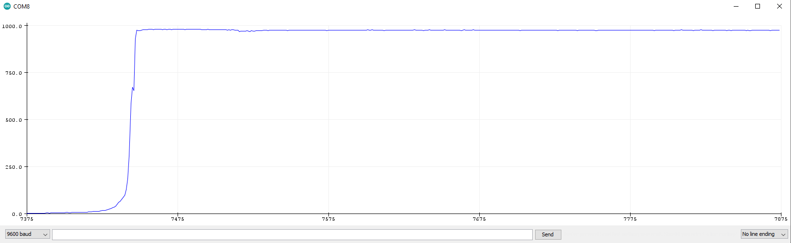
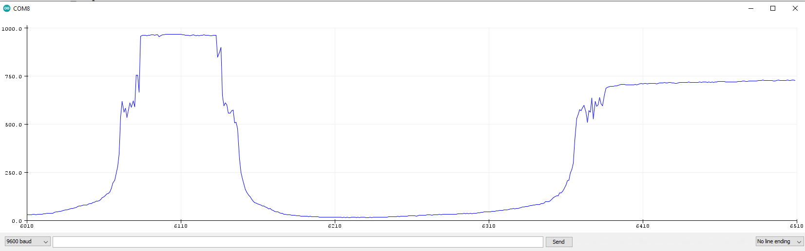
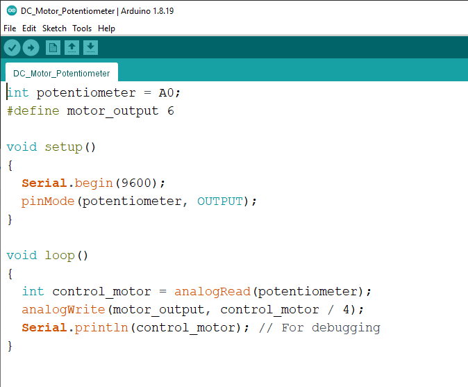

+++
fragment = "content"
weight = 100
disabled = false
+++

# Electronic Input Devices

The input device that I wanted to use was a potentiometer. Specifically, I wanted to be able to control a DC motor based on the potentiometer input; to create something of a throttle.

I found [an old blog post](https://www.makersgeneration.net/single-post/2017/12/30/How-to-control-a-DC-motor-speed-with-a-Arduino-Uno-board-and-a-potentiometer) about doing just this. It includes this wiring diagram:

In this wiring, the transistor acts as a digital switch and the diode is needed for PWM. When the motor is turned off in a PWM cycle, it coasts instead of stopping, which makes it act as a generator and it generates *a lot* of energy (for a small amount of time), which is enough to damage the electronics. However, this "backflow" of energy flips the polarity of the diode, which then re-routes it, almost turning the motor into a resistor for itself. Once the motor has stopped acting as a generator, the diode routes everything back to normal and the cycle can repeat.

Foolishly, for my first attempt, I decided to solder everything up instead of using a breadboard.

Now, I'm pretty sure that the transistor was backwards (an easy fix on a breadboard), but, even if this circuit worked, it would have set a bad precedant, so perhaps it's good that it failed.

So, I redid the wiring, this time on a breadboard.

I needed a secondary power source, so I alligator clipped-up a 5V wall adapter.

I added a print statement to plot the potentiometer. Here is a plot of the potentiometer's inputs:

And the code:

The input appears a little jagged, but, once the graph rescales properly, it looks very smooth. And... it works! Here's a video: